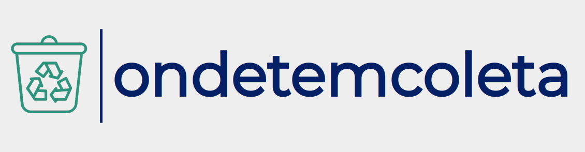

<h1 align="center">
  
</h1>
<h2 align="center"><a href="https://ondetemcoleta.herokuapp.com/"> Onde tem coleta? </a></h2>
<h5 align="center">uma plataforma para facilitar o descarte correto de lixo</h5>

<p align="center">
 <a href="#sobre">Sobre</a> •
 <a href="#o-que-a-plataforma-faz">O que a plataforma faz</a> • 
 <a href="#tecnologias">Tecnologias</a> • 
 <a href="#serviços-usados">Serviços usados</a> • 
 <a href="#como-usar">Como usar</a> • 
 <a href="#licença">Licença</a> • 
 <a href="#autora">Autora</a>
</p>

## Sobre

Ondetemcoleta? é uma plataforma criada para disponibilizar a comunidade um banco de pontos de coleta de lixo especial. O lixo especial é todo material que, por conta de suas características físicas e químicas, não pode ser descartado junto com o lixo comum ou reciclável (como pilhas, baterias, vidro quebrado e óleo de cozinha). Esses resíduos precisam receber tratamento diferenciado para que seu descarte não prejudique drasticamente o meio ambiente.

## O que a plataforma faz

- Busca e visualização de locais de coleta de lixo especial, filtrando por localidade ou nome.
- Inserção de locais de coleta de lixo especial.

## Tecnologias

* [Ruby 2.7.2](https://www.ruby-lang.org/)
* [Rails 6.0.3](https://rubyonrails.org/)
* [PostgreSQL 11.10](https://www.postgresql.org/)

## Serviços usados

* [Github](https://github.com/)
* [Heroku](https://heroku.com/)

## Como usar

```ruby
# Clone o projeto e acesse a pasta

git clone https://github.com/biancaguzenski/ondetemcoleta.git

cd ondetemcoleta

# Verifique se a versão do ruby e do rails é compatível

ruby -v
rails -v

# Instale dependencias

bundle && yarn

# Crie o banco de dados

rake db:create db:migrate

# Rode os testes

rails test

# Rode no servidor local

rails s

# A aplicação será aberta em http://localhost:3000
```


## Licença

Este projeto usa a licença MIT.

## Autora

Feito com :heart:! Entre em contato!
[ <br> <sub> Bianca Guzenski </sub>](https://github.com/biancaguzenski) |
| :---: |  
[](https://www.linkedin.com/in/biancaguzenski/) 
[](mailto:biancalway@gmail.com)
